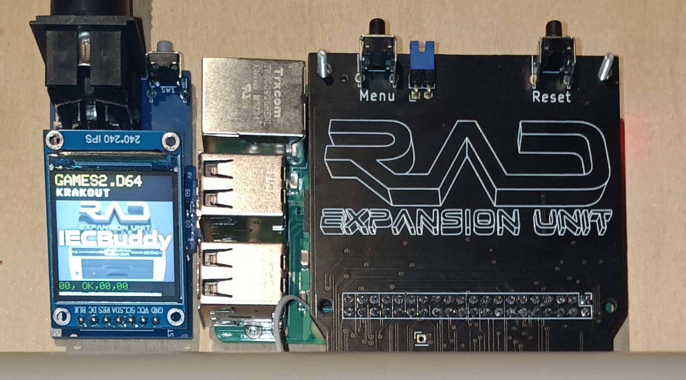
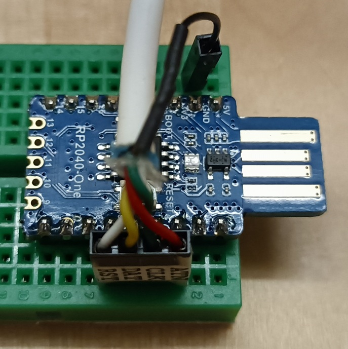
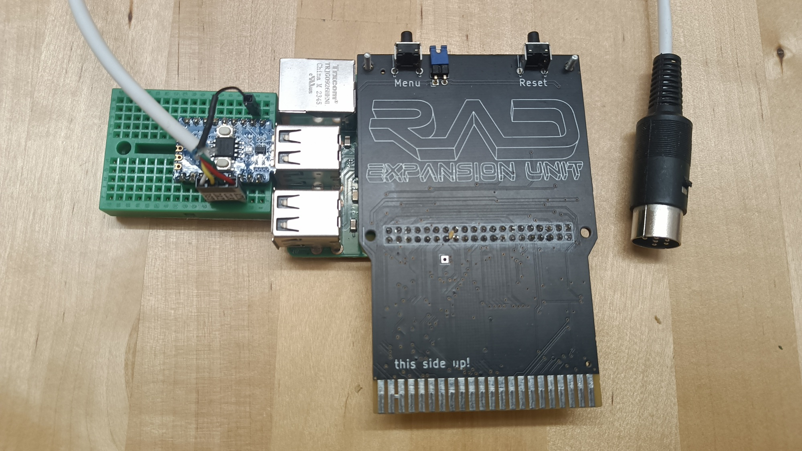
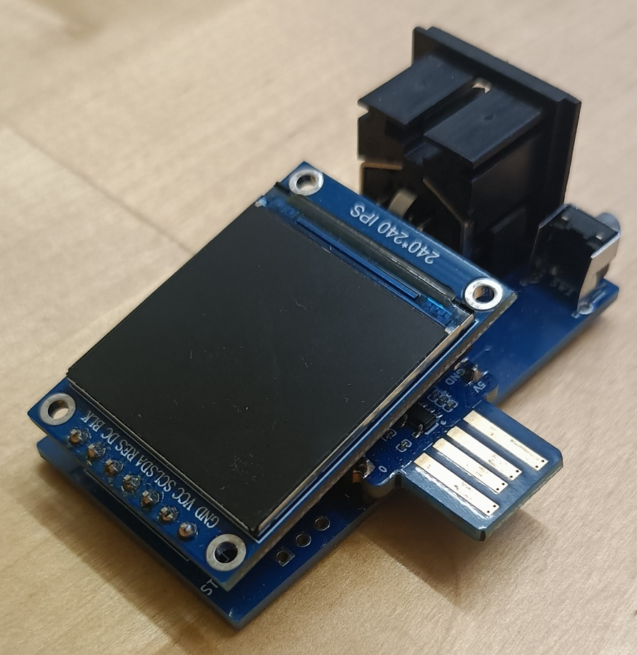
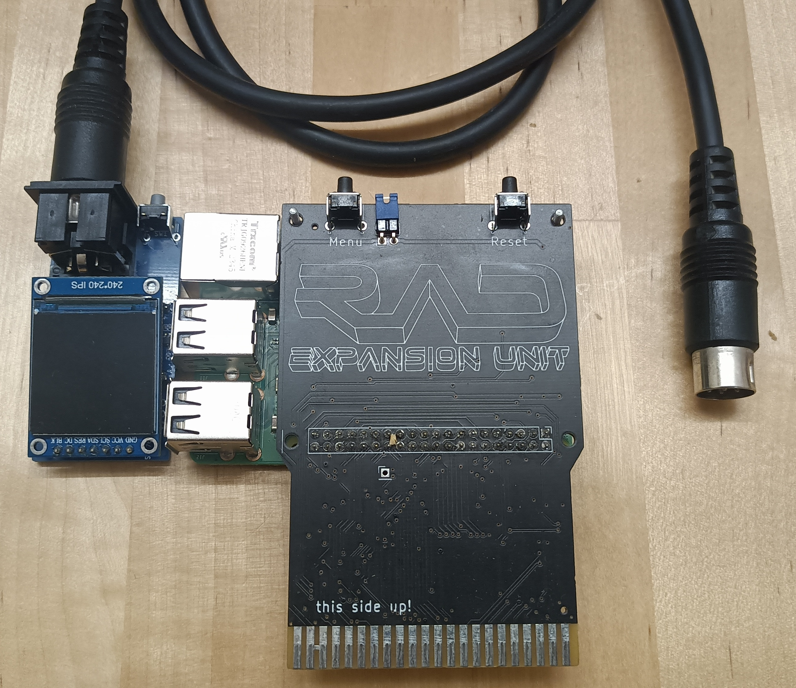
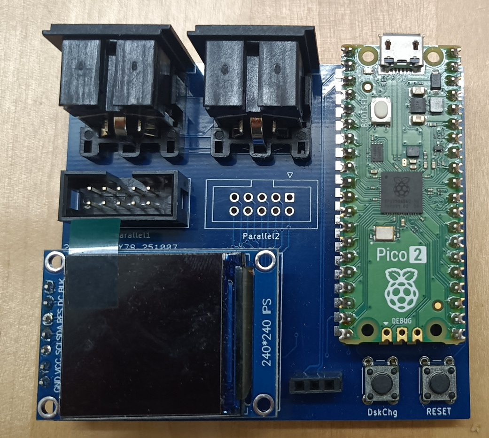
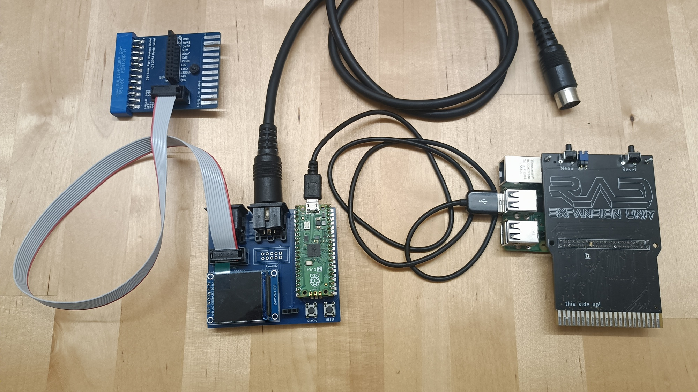

# IECBuddy

IECBuddy is a USB plug-in for the [C64 RAD Expansion Unit](https://github.com/frntc/RAD), giving the RAD
access to the C64's IEC bus. The IECBuddy is based on my [IECDevice](https://github.com/dhansel/IECDevice)
and [VDrive](https://github.com/dhansel/VDrive) libraries, allowing the RAD to support various disk image 
formats (D64, G64, D71, D81) and fast-load protocols (JiffyDos, Epyx FastLoad, Final Cartridge 3, Action Replay 6,
DolphinDos and SpeedDos).

 
  

  
  

 

The IECBuddy comes in four different variants, with differing amounts of components and build effort required:
  * [Barebones](IECBuddy-Barebones) (no PCB required)
  * [Micro](IECBuddy-Micro) (like Barebones but with a PCB and disk change button)
  * [Mini](IECBuddy-Mini) (like Micro but with a display and better bus interface)
  * [Max](IECBuddy-Max) (like Mini but with parallel cable connector)

All variants can plug directly into a RAD powered by a Raspberry Pi 3. If your RAD uses a Raspberry Pi Zero then 
you will need [an adapter cable](https://www.raspberrypi.com/products/micro-usb-male-to-usb-a-female-cable/) 
to connect the IECBuddy since the Zero only has a micro-USB port.

## IECBuddy Barebones

The barebones variant is the simplest version, requiring no manufactured PCB, just a [RP2040-One](https://www.amazon.com/RP2040-One-Pico-Like-Raspberry-Dual-Core-Processor/dp/B0BMM7SS99)
board and a Commodore [serial cable](https://www.c64-wiki.com/wiki/Serial_Port). Either solder the cable directly to the RP2040-One or set it up on a breadboard:

 
  

  
  
  

 

Connect the Commodore serial cable to the RP2040-One as follows:

IEC Bus Pin | Signal   | RP2040-One
------------|----------|-----------
1           | SRQ      | Not connected 
2           | GND      | GND
3           | ATN      | 2
4           | CLK      | 3 
5           | DATA     | 4 
6           | RESET    | 5 
  
Then upload the IECBuddy Micro firmware to the RP2040-One and you're good to go.
Downsides are that there is no display and no "Disk Change" button.
If you would like a "Disk Change" button, simply wire a pushbutton switch between pins GND and 8 on the RP2040-One.

Note that this connects the 5V IEC bus lines directly to the RP2040 inputs. There are varying
opinions online on whether or not this can damage the RP2040 and/or whether the RP2040 is
capable of properly driving the IEC bus lines (especially when multiple devices are connected).
In my testing I have not had any problems, even with multiple other devices connected. YMMV.

If you would prefer proper voltage conversion and line drivers then use the "Mini" version below.

## IECBuddy Micro

If you would like a somewhat cleaner and more permanent build but still want to go with a very small
footprint and minimal component count, use the "IECBuddy Micro" variant. You can either solder
the serial cable directly onto the board (connections are labeled on the board) or solder a 
proper IEC connector onto the board and use a standard serial cable. This also comes with
space for a pushbutton switch. No display though.

The same caveats regarding voltage conversion and line drivers apply as described in the "Barebones" section above.

A Gerber file for PCB production can be downloaded [here]().
You will need the following components (the given links are just suggestions, I do not get any kickbacks for them).

Designator | Component 
-----------|-----------
U1         | [RP2040-One](https://www.amazon.com/RP2040-One-Pico-Like-Raspberry-Dual-Core-Processor/dp/B0BMM7SS99)
SW1        | [Pushbutton Switch](https://www.digikey.com/en/products/detail/c-k/PTS645VH58-2-LFS/1146783)
IEC1       | [IEC Bus Connector (6 Pin)](https://www.aliexpress.us/item/3256807108500271.html)

You can skip the IEC1 connector if you solder the serial cable directly to the board (connections on the board are labeled).

## IECBuddy Mini

  

  
  
  

The Mini variant is slightly larger than the Micro version and requires more components besides
the RP2040-One. As a result it comes with the following features that are not present in the smaller versions:

First, it has space and connections on the PCB for a [0.96" TFT display](https://www.aliexpress.us/item/2251832810664524.html).
The display shows the currently mounted disk image as well as disk status and progress bars while loading.

Second, it uses 7406 and 74LVC04 ICs for voltage conversion and properly interfacing with and driving the Commodore IEC bus lines.
This is very similar to the way original hardware (like the 1541) interfaces to the IEC bus. It also protects the RP2040
from the possible overcurrent and overvoltage conditions described in the "Barebones" section above.

A Gerber file for PCB production can be downloaded [here]().
You will need the following components (the given links are just suggestions, I do not get any kickbacks for them).

Designator | Component 
-----------|-----------
R1,R2,R3,R4| [Resistor 1kOhm SMD0805](https://www.digikey.com/en/products/detail/stackpole-electronics-inc/RMCF0805FT1K00/1760090)
C1,C2      | [Ceramic Capacitor 100uF SMD0805](https://www.digikey.com/en/products/detail/kyocera-avx/KGM21NR71H104KT/563505)
U1         | [RP2040-One](https://www.amazon.com/RP2040-One-Pico-Like-Raspberry-Dual-Core-Processor/dp/B0BMM7SS99)
U2         | [74LVC04AD SOIC](https://www.digikey.com/en/products/detail/nexperia-usa-inc/74LVC04AD-118/946673)
U3         | [7406DR SOIC](https://www.digikey.com/en/products/detail/texas-instruments/SN7406DR/276661)
SW1        | [Pushbutton Switch](https://www.digikey.com/en/products/detail/c-k/PTS645VH58-2-LFS/1146783)
ST7789     | [TFT Display](https://www.aliexpress.us/item/2251832810664524.html)
IEC1       | [IEC Bus Connector (6 Pin)](https://www.aliexpress.us/item/3256807108500271.html)

Various components can be left out if desired:
  * You can leave out the IEC1 connector if you solder the serial cable directly to the board (connections on the board are labeled).
  * You can leave out the ST7789 display if you don't want a display.
  * If you don't want to use the IEC bus driver ICs then you can place solder on the JP1-JP5 solder jumpers and leave out R1-R4, C1, C2, U2 and U3 (in this case use the IECBuddyMicro.uf2 firmware).

## IECBuddy Max

The IECBuddy Max variant has a much larger PCB layout and uses a Raspberry Pi Pico (version 1 or 2).
It has all the features of the Mini version but also provides a connector for a parallel cable to be used
with Dolphin Dos and Speed Dos. Descriptions on how to make a compatible parallel cable can be found in
various places over the internet, for example
[here](https://github.com/dhansel/IECDevice/tree/main/hardware#user-port-breakout-board),
[here](https://github.com/svenpetersen1965/1541-parallel-adapter-SpeedDOS)
or [here](https://github.com/FraEgg/commodore-1541-parallel-port-adapter-c64-c128-speeddos-dolphindos)

  

  
  
  

A Gerber file for PCB production can be downloaded [here]().
You will need the following components (the given links are just suggestions, I do not get any kickbacks for them).

Designator | Component 
-----------|-----------
R1,R2,R3,R4| [Resistor 1kOhm SMD0805](https://www.digikey.com/en/products/detail/stackpole-electronics-inc/RMCF0805FT1K00/1760090)
C1,C2,C3   | [Ceramic Capacitor 100uF SMD0805](https://www.digikey.com/en/products/detail/kyocera-avx/KGM21NR71H104KT/563505)
U1         | [Raspberry Pi Pico](https://www.microcenter.com/product/661033/raspberry-pi-pico-microcontroller-development-board)
U2         | [74CBTD3861DW](https://www.digikey.com/en/products/detail/texas-instruments/SN74CBTD3861DW/378015)
U3         | [74LVC04AD SOIC](https://www.digikey.com/en/products/detail/nexperia-usa-inc/74LVC04AD-118/946673)
U4         | [7406DR SOIC](https://www.digikey.com/en/products/detail/texas-instruments/SN7406DR/276661)
Reset,DiskChg | [Pushbutton Switch](https://www.digikey.com/en/products/detail/same-sky-formerly-cui-devices-/TS02-66-60-BK-100-LCR-D/15634327)
ST7789     | [TFT Display](https://www.aliexpress.us/item/2251832810664524.html)
IEC1       | [IEC Bus Connector (6 Pin)](https://www.aliexpress.us/item/3256807108500271.html)
Parallel1, Parallel2 | [10-position IDC Connector](https://www.digikey.com/en/products/detail/on-shore-technology-inc/302-S101/2178422)

## Firmware (pre-compiled)

Pre-compiled versions of the firmware are available for all four versions of the IECBuddy. Programming the 2040
is easy:
  - Download the UF2 file appropriate for your version of the board:
    * Barebones and Micro (and Mini if built without the bus driver ICs): IECBuddyMicro.uf2
    * Mini: IECBuddyMini.uf2
    * Max: IECBuddyMax.uf2
  - Plug the RP2040-One into one of your computer's USB port, this should automatically mount as a new drive.
  - Copy the downloaded UF2 file to the root directory of the drive.
  - Disconnect the RP2040-One from your computer.

## Firmware (source)

To compile the firmware from source follow these steps
  - Download this GitHub repository
  - Load the "IECBuddy.ino" file in the Arduino IDE
  - Select the "Waveshare RP2040-One" board (or Raspberry Pi Pico 1 or 2 for the Max variant).
  - Edit the "Pins.h" file to configure for your desired variant:
    * For the Barebones and Micro variants no changes are required
    * For the Mini or Max variants, un-comment the #defines for PIN_IEC_CLK_OUT and PIN_IEC_DATA_OUT
  - If your build should support the ST7789 display then un-comment the PIN_ST7789_* defines. In that case you
    also need to make sure the "Adafruit GFX Library" is installed. You can compile in the display support even
    if you don't actually have a display.
  - Plug in your RP2040-One or Pi Pico board and click the "upload" button in the Arduino IDE
