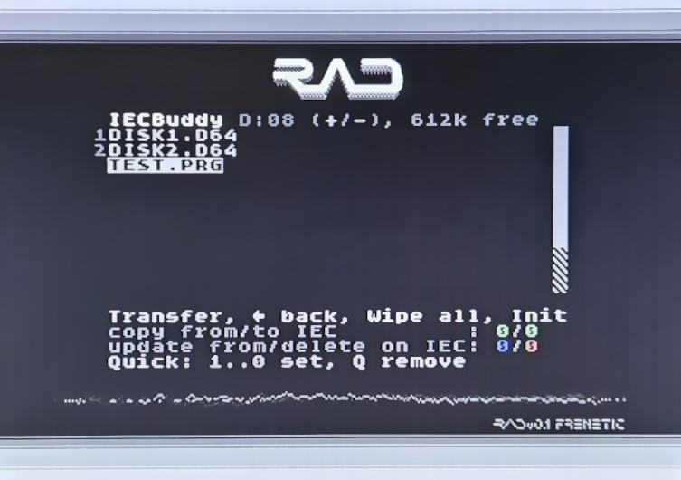
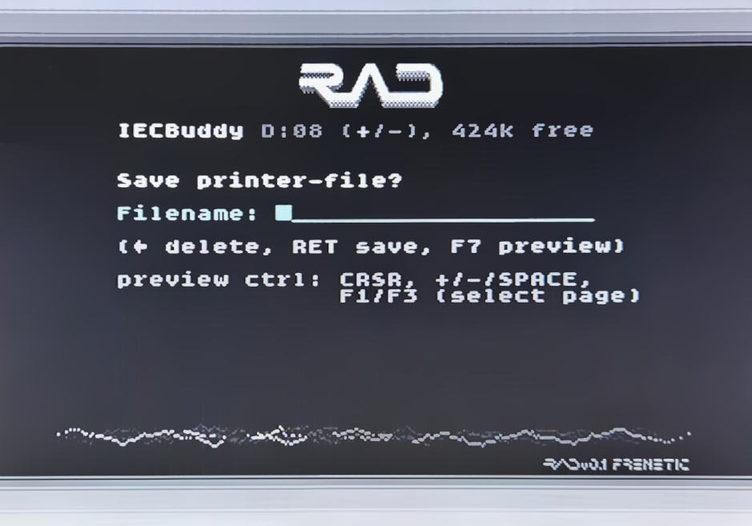

# IECBuddy

IECBuddy is a USB plug-in for the [C64 RAD Expansion Unit](https://github.com/frntc/RAD), giving the RAD
access to the C64's IEC bus. The IECBuddy is based on my [IECDevice](https://github.com/dhansel/IECDevice)
and [VDrive](https://github.com/dhansel/VDrive) libraries, allowing the RAD to support various disk image 
formats (D64, G64, D71, D81) and fast-load protocols (JiffyDos, Epyx FastLoad, Final Cartridge 3, Action Replay 6,
DolphinDos and SpeedDos). Additionally, the IECBuddy acts as a virtual printer. Printed content can be viewed
on the C64 screen from within the RAD menu.

 
  

  
  
  

 

The IECBuddy comes in four different variants, with differing amounts of components and build effort required:
  * [Barebones](IECBuddy-Barebones) (no PCB, use any RP2040/RP235x module)
  * [Micro](IECBuddy-Micro) (like Barebones but with a PCB and disk change button, requires a RP module pin-compatible with RP2040-One)
  * [Mini](IECBuddy-Mini) (like Micro but with a display and better bus interface, requires a RP module pin-compatible with RP2040-One)
  * [Max](IECBuddy-Max) (like Mini but with parallel cable connector, requires a RP module pin-compatible with Raspberry Pi Pico)

Of course a myriad versions of RP2040 and R235x modules exist. The PCBs for the IECBuddy Micro and Mini variants assume the pinout
of a [RP2040-One](https://www.amazon.com/RP2040-One-Pico-Like-Raspberry-Dual-Core-Processor/dp/B0BMM7SS99). The PCB for the
IECBuddy Max variant assumes the pinout of a Raspberry Pi Pico. The IECBuddy Barebones variant can work with any RP2040 or RP235x module.

To keep things a bit more succinct, in the folling "RP module" stands for "RP2040/RP235x module".

If you have a module with a pinout matching your preferred IECBuddy variant, first check if your module is listed in the UF2 table within the
[uploading the firmware](#uploading-the-firmware) section. If you cannot use one of the provided UF2 firmware files it should still
be fairly easy to [compile and upload](software/IECBuddy/README.md) the firmware yourself.

The IECBuddy stores files and disk images in the RP module's flash memory. One MB of flash memory is used for the
firmware itself, the remainder can be used for storing disk images. One MB of flash memory can hold about six D64 disk images.
Note that disk images can easily be transferred between the RAD and the IECBuddy so the IECBuddy does not need to hold all
your disk images at the same time.

The IECBuddy can plug directly into a RAD powered by a Raspberry Pi 3. If your RAD uses a Raspberry Pi Zero then 
you will need [an adapter cable](https://www.raspberrypi.com/products/micro-usb-male-to-usb-a-female-cable/) 
to connect the IECBuddy since the Zero only has a micro-USB OTG port.

To build an IECBuddy, select and build whichever variant appeals to you and then follow the instructions in the
[Uplodading the firmware](#uploading-the-firmware) section below.

## IECBuddy Barebones

The barebones variant is the simplest version, requiring no manufactured PCB. While the pictures shown here use
a [RP2040-One](https://www.amazon.com/RP2040-One-Pico-Like-Raspberry-Dual-Core-Processor/dp/B0BMM7SS99) module, any
RP module should work. Additionally you will need a Commodore [serial cable](https://www.c64-wiki.com/wiki/Serial_Port)
connector. Either solder the cable directly to the RP module or set it up on a breadboard:

 
  

  
  
  

 

Connect the Commodore serial cable to the RP module as follows:

IEC Bus Pin | Signal   | RP module
------------|----------|-----------
1           | SRQ      | Not connected 
2           | GND      | GND
3           | ATN      | GPIO2
4           | CLK      | GPIO3 
5           | DATA     | GPIO4 
6           | RESET    | GPIO5 

Then [upload the IECBuddy Micro firmware](#uploading-the-firmware) to the RP module and you're good to go.
Downsides are that there is no display and no "Disk Change" button.
If you would like a "Disk Change" button, simply wire a pushbutton switch between pins GND and GPIO8 on the RP module.

Note that this connects the 5V IEC bus lines directly to the RP module inputs. There are varying
opinions online on whether or not this can damage the RP and/or whether the RP is
capable of properly driving the IEC bus lines (especially when multiple devices are connected).
In my testing I have not had any problems, even with multiple other devices connected. YMMV.

If you would prefer proper voltage conversion and line drivers then use the "Mini" version below.

## IECBuddy Micro

 
  

  
  
  

 

If you would like a somewhat cleaner and more permanent build but still want to go with a very small
footprint and minimal component count, use the "IECBuddy Micro" variant. This PCB requires a RP
module that is pin-compatible with the RP2040-One. Check the [Uplodading the firmware](#uploading-the-firmware) 
section below to see which RP modules are supported.

You can either solder the serial cable directly onto the board (connections are labeled on the board) or solder a 
proper IEC connector onto the board and use a standard serial cable. This also comes with
space for a pushbutton switch. No display though.

The same caveats regarding voltage conversion and line drivers apply as described in the "Barebones" section above.

A Gerber file for PCB production can be downloaded [here](https://github.com/dhansel/IECBuddy/raw/refs/heads/main/hardware/IECBuddy-micro-gerber.zip). 
A PDF file with the schematics is available [here](https://github.com/dhansel/IECBuddy/raw/refs/heads/main/hardware/IECBuddy-micro-schematic.pdf). 
KiCad files for the board are [here](hardware/IECBuddy-micro).

You will need the following components (the given links are just suggestions, I do not get any kickbacks for them).

Designator | Component 
-----------|-----------
U1         | [RP2040-One](https://www.amazon.com/RP2040-One-Pico-Like-Raspberry-Dual-Core-Processor/dp/B0BMM7SS99)
SW1        | [Pushbutton Switch](https://www.digikey.com/en/products/detail/c-k/PTS645VH58-2-LFS/1146783)
IEC1       | [IEC Bus Connector (6 Pin)](https://www.aliexpress.us/item/3256807108500271.html)

You can skip the IEC1 connector if you solder the serial cable directly to the board (connections on the board are labeled).

## IECBuddy Mini

  

  
  
  

The Mini variant is slightly larger than the Micro version and requires more components besides
the RP module. As a result it comes with the following features that are not present in the smaller versions:

First, it has space and connections on the PCB for a [0.96" TFT display](https://www.aliexpress.us/item/2251832810664524.html).
The display shows the currently mounted disk image as well as disk status and progress bars while loading.

Second, it uses 7406 and 74LVC04 ICs for voltage conversion and properly interfacing with and driving the Commodore IEC bus lines.
This is very similar to the way original hardware (like the 1541) interfaces to the IEC bus. It also protects the RP
from the possible overcurrent and overvoltage conditions described in the "Barebones" section above.

Like the Micro variant, this PCB requires a RP module that is pin-compatible with the RP2040-One. 
Check the [Uplodading the firmware](#uploading-the-firmware) section below to see which RP modules are supported.

A Gerber file for PCB production can be downloaded [here](https://github.com/dhansel/IECBuddy/raw/refs/heads/main/hardware/IECBuddy-mini-gerber.zip). 
A PDF file with the schematics is available [here](https://github.com/dhansel/IECBuddy/raw/refs/heads/main/hardware/IECBuddy-mini-schematic.pdf). 
KiCad files for the board are [here](hardware/IECBuddy-mini).

You will need the following components (the given links are just suggestions, I do not get any kickbacks for them).

Designator | Component 
-----------|-----------
R1,R2,R3,R4| [Resistor 1kOhm SMD0805](https://www.digikey.com/en/products/detail/stackpole-electronics-inc/RMCF0805FT1K00/1760090)
C1,C2      | [Ceramic Capacitor 100uF SMD0805](https://www.digikey.com/en/products/detail/kyocera-avx/KGM21NR71H104KT/563505)
U1         | [RP2040-One](https://www.amazon.com/RP2040-One-Pico-Like-Raspberry-Dual-Core-Processor/dp/B0BMM7SS99)
U2         | [74LVC04AD SOIC](https://www.digikey.com/en/products/detail/nexperia-usa-inc/74LVC04AD-118/946673)
U3         | [7406DR SOIC](https://www.digikey.com/en/products/detail/texas-instruments/SN7406DR/276661)
SW1        | [Pushbutton Switch](https://www.digikey.com/en/products/detail/c-k/PTS645VH58-2-LFS/1146783)
ST7789     | [TFT Display](https://www.aliexpress.us/item/2251832810664524.html)
IEC1       | [IEC Bus Connector (6 Pin)](https://www.aliexpress.us/item/3256807108500271.html)

Various components can be left out if desired:
  * You can leave out the IEC1 connector if you solder the serial cable directly to the board (connections on the board are labeled).
  * You can leave out the ST7789 display if you don't want a display.
  * If you don't want to use the IEC bus driver ICs then you can place solder on the JP1-JP5 solder jumpers and leave out R1-R4, C1, C2, U2 and U3 (in this case use the IECBuddyMicro.uf2 firmware).

I recommend uploading the firmware **before** soldering on the display. The display sits on top of the RP module, which
makes accessing the "Boot" button (required for firmware upload) tricky - still possible, but a bit fiddly.

## IECBuddy Max

The IECBuddy Max variant has a much larger PCB layout and uses a Raspberry Pi Pico (version 1 or 2).
It has all the features of the Mini version and additionally a second IEC port for daisy-chaining 
and a connector for a parallel cable to be used with Dolphin Dos and Speed Dos.
Descriptions on how to make a compatible parallel cable and user port connector can be found in
various places over the internet, for example
[here](https://github.com/dhansel/IECDevice/tree/main/hardware#user-port-breakout-board),
[here](https://github.com/svenpetersen1965/1541-parallel-adapter-SpeedDOS)
or [here](https://github.com/FraEgg/commodore-1541-parallel-port-adapter-c64-c128-speeddos-dolphindos)

  

  
  
  

A Gerber file for PCB production can be downloaded [here](https://github.com/dhansel/IECBuddy/raw/refs/heads/main/hardware/IECBuddy-max-gerber.zip). 
A PDF file with the schematics is available [here](https://github.com/dhansel/IECBuddy/raw/refs/heads/main/hardware/IECBuddy-max-schematic.pdf). 
KiCad files for the board are [here](hardware/IECBuddy-max).

This PCB requires a RP module that is pin-compatible with the Raspberry Pi Pico. 
Check the [Uplodading the firmware](#uploading-the-firmware) section below to see which RP modules are supported.

You will need the following components (the given links are just suggestions, I do not get any kickbacks for them).

Designator | Component 
-----------|-----------
R1,R2,R3,R4| [Resistor 1kOhm SMD0805](https://www.digikey.com/en/products/detail/stackpole-electronics-inc/RMCF0805FT1K00/1760090)
C1,C2,C3   | [Ceramic Capacitor 100uF SMD0805](https://www.digikey.com/en/products/detail/kyocera-avx/KGM21NR71H104KT/563505)
U1         | [Raspberry Pi Pico](https://www.microcenter.com/product/661033/raspberry-pi-pico-microcontroller-development-board)
U2         | [74CBTD3861DW](https://www.digikey.com/en/products/detail/texas-instruments/SN74CBTD3861DW/378015)
U3         | [74LVC04AD SOIC](https://www.digikey.com/en/products/detail/nexperia-usa-inc/74LVC04AD-118/946673)
U4         | [7406DR SOIC](https://www.digikey.com/en/products/detail/texas-instruments/SN7406DR/276661)
Reset,DiskChg | [Pushbutton Switch](https://www.digikey.com/en/products/detail/same-sky-formerly-cui-devices-/TS02-66-60-BK-100-LCR-D/15634327)
ST7789     | [TFT Display](https://www.aliexpress.us/item/2251832810664524.html)
IEC1       | [IEC Bus Connector (6 Pin)](https://www.aliexpress.us/item/3256807108500271.html)
Parallel1, Parallel2 | [10-position IDC Connector](https://www.digikey.com/en/products/detail/on-shore-technology-inc/302-S101/2178422)

## Uploading the firmware

Pre-compiled versions of the firmware are available for all four versions of the IECBuddy and a variety of RP modules. 

If your RP module is included in the table below then programming is trivial. First, download the UF2 file appropriate for your IECBuddy variant and RP module
("---" in the table means "not supported because the RP module does not match the PCB"):

IECBuddy   | [RP2040-One](https://www.amazon.com/RP2040-One-Pico-Like-Raspberry-Dual-Core-Processor/dp/B0BMM7SS99)   (4MB flash) | [RP2350-One](https://www.ebay.com/itm/286217752456)   (4MB flash) | [TENSTAR RP2350](https://aliexpress.com/item/1005008622261552.html)   (16MB flash) | Pi Pico   (2MB flash) | Pi Pico 2   (4MB flash) | [Purple Pico](https://de.aliexpress.com/item/1005005594351599.html)   (16MB flash)
-----------|------------|------------|-------------------|----------------|---------------------|---------------------
Barebones  | [UF2](https://github.com/dhansel/IECBuddy/raw/refs/heads/main/software/IECBuddyMicro2040One.uf2) | [UF2](https://github.com/dhansel/IECBuddy/raw/refs/heads/main/software/IECBuddyMicro2350One.uf2) | [UF2](https://github.com/dhansel/IECBuddy/raw/refs/heads/main/software/IECBuddyMicroTenstar2350.uf2) | [UF2](https://github.com/dhansel/IECBuddy/raw/refs/heads/main/software/IECBuddyMicroPico1.uf2) | [UF2](https://github.com/dhansel/IECBuddy/raw/refs/heads/main/software/IECBuddyMicroPico2.uf2) | [UF2](https://github.com/dhansel/IECBuddy/raw/refs/heads/main/software/IECBuddyMicroPurplePico.uf2)
Micro      | [UF2](https://github.com/dhansel/IECBuddy/raw/refs/heads/main/software/IECBuddyMicro2040One.uf2) | [UF2](https://github.com/dhansel/IECBuddy/raw/refs/heads/main/software/IECBuddyMicro2350One.uf2) | [UF2](https://github.com/dhansel/IECBuddy/raw/refs/heads/main/software/IECBuddyMicroTenstar2350.uf2) | --- | --- | ---
Mini       | [UF2](https://github.com/dhansel/IECBuddy/raw/refs/heads/main/software/IECBuddyMini2040One.uf2) | [UF2](https://github.com/dhansel/IECBuddy/raw/refs/heads/main/software/IECBuddyMini2350One.uf2)  | [UF2](https://github.com/dhansel/IECBuddy/raw/refs/heads/main/software/IECBuddyMiniTenstar2350.uf2)  | --- | --- | ---
Max        | --- | --- | --- | [UF2](https://github.com/dhansel/IECBuddy/raw/refs/heads/main/software/IECBuddyMaxPico1.uf2) | [UF2](https://github.com/dhansel/IECBuddy/raw/refs/heads/main/software/IECBuddyMaxPico2.uf2) | ---

Then:
  1) Connect the USB connector of the RP module to your computer in "boot" mode. This can be done in two ways:
     - Make the connection to the computer **while holding down the "Boot" button on the device**. Note that this can be tricky
       for the Mini version if you have already soldered the display since the display obstructs access to the RP2040-One.
     - Just connect the RP module without holding the "Boot" button down. This will register a new serial (COM) port on your computer.
       Download [SKTool.exe](https://github.com/dhansel/IECBuddy/raw/refs/heads/main/software/SKTool/SKTool.exe) and run it with the following parameters: `SKTool -p COMx boot` (where COMx is the new COM port).
       Alternatively, start a terminal program (e.g. TeraTerm, Putty or even the serial monitor in the Arduino IDE) and connect
       to the new COM port with a baud rate of 1200.
     As a result of either of these, your computer should now show a new external drive.
  2) Copy the downloaded UF2 file to the root directory of the new drive.
  3) Disconnect the RP module from your computer.

If your RP module is not included in the table above and/or you would like to compile the firmware yourself, instructions can be found [here](software/IECBuddy/README.md). 

## Usage

When it is connected to the RAD (via USB) and C64 (via serial cable), the IECBuddy behaves like a disk drive.
The initial device number is 8 but can be configured from within the RAD menu system.

The IECBuddy is based on the [IECDevice library](https://github.com/dhansel/IECDevice) and therefore supports the 
same fastload protocols: JiffyDos, Epyx FastLoad, Final Cartridge 3, Action Replay 6, DolphinDos and SpeedDos.
Games that use their own fastload protocols will likely not work, the IECBuddy will report error "M-E not supported"
and the on-board LED will blink quickly (5Hz as opposed to 2Hz for a regular error).

Loading the directory shows all files and disk images currently on the IECBuddy file system. You can use "CD"
to enter and exit disk images. If you have a DOS wedge (like in JiffyDos), `@CD:GAMES.D64` will enter the GAMES.D64
Disk image, `@CD/` will exit the image and go back to the top-level directory. If you do not have a DOS wedge, 
doing a `LOAD"GAMES.D64",8` will automatically switch into the GAMES.D64 disk image and load its directory,
`LOAD"/",8` will return to the top level.

If desired, a new disk image can be created by using the "N" command, for examplem, executing `@N:GAMES2.D64`
in the top-level dierctory will create a new disk image named GAMES2.D64.

Files (either PRG files or disk images) can be copied between the IECBuddy and the RAD's SD card via the RAD menu system.
To enter the [IECBuddy submenu](https://github.com/frntc/RAD#iecbuddy-submenu) on the RAD, press "I" within the RAD main menu.

 
  

  
  

 

The IECBuddy also emulates a printer, more specifically a STAR NL-10 printer with device number 4. The STAR NL-10 was
compatible with Commodore MPS-801 commands as well as the EPSON FX-80 command set. Much of the existing C64 software
supports either one of these (if not specifically the NL-10) and should therefore be compatible.

After printing, enter the RAD menu to see a preview of the printout and/or copy a BMP or PDF version of the printed
content to the RAD's SD card.

 
  

  
  

 

For more information on the RAD menu structure relating to the IECBuddy see [here](https://github.com/frntc/RAD#iecbuddy-submenu).

As an alternative to copying files via the RAD menu interface you can use connect the IECBuddy to your PC 
and use [SKTool](software/SKTool) to manage the files directly.
